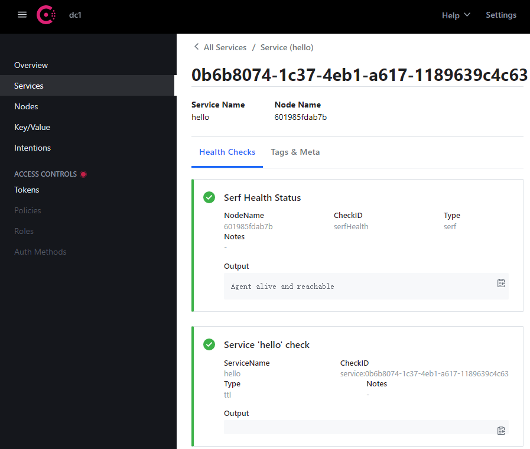

## Gin框架引入
```golang
//默认路由
r := gin.Default()
//注册处理方法
r.Handle("GET", "/user", func(context *gin.Context) {
context.String(200, "user api")
})
r.Handle("GET", "/admin", func(context *gin.Context) {
context.String(200, "admin api")
})

//这里使用的是go-micro v3的服务器，来启动服务
server := web.NewService(
//web.Name("hello"),
web.Address(":8001"),
web.Handler(r),
//web.Registry(csReg),
)
server.Run()
```

## 服务注册
```golang
//使用consul进行服务注册
csReg := consul.NewRegistry(
	registry.Addrs("20.124.120.120:8500")) 

server := web.NewService(
web.Name("hello"),//配置服务名
//web.Address(":8001"),
//web.Handler(r),
web.Registry(csReg),//配置consul
)
```



## 易错的地方
- go-micro项目版本管理比较混乱，容易引入错误的包
- registry放到了go-micro/plugins项目下
- registry要使用consul的(而默认是etcd)，consul使用docker配置更简单

引用到的包如下：
- "github.com/asim/go-micro/v3/registry"
- "github.com/asim/go-micro/v3/web"
- "github.com/gin-gonic/gin"
- "github.com/go-micro/plugins/v3/registry/consul"