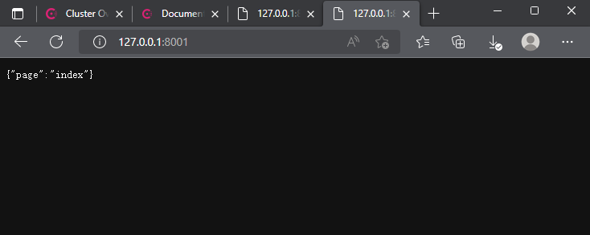
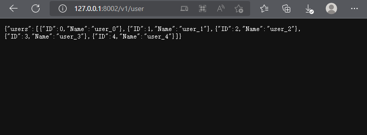

## 思路
按照lesson1的内容，修改成lesson2的两个服务

index作为网站的主页，user作为网站的api接口

**并不是所有服务都需要在consul中注册服务**
## index服务
index用来模拟首页

## user服务
user 生成一个用户列表并返回
```golang
type User struct {
    ID   int
    Name string
}

func GetUserList(num int) (u []*User) {
	u = make([]*User, num)
	for i, _ := range u {
		u[i] = &User{
			ID:   i,
			Name: "user_" + strconv.Itoa(i),
		}
	}
	return
}
```
可以使用 RouterGroup.Group()来进行分组
```golang
v1 := r.Group("/v1")
```
## 结果
此时index主页和user api并没有相关联，是作为两个服务独立存在的，分别访问`127.0.0.1:8001`和`127.0.0.1:8002/v1/user`就可以看到效果。

之后会学习如何进行数据交互。



