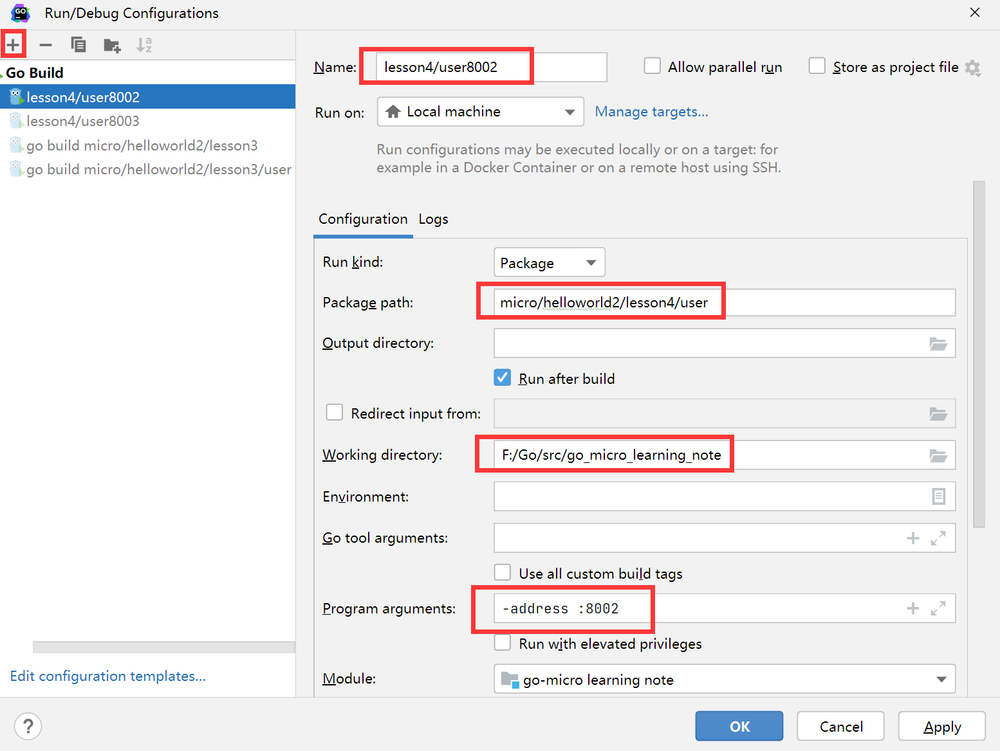
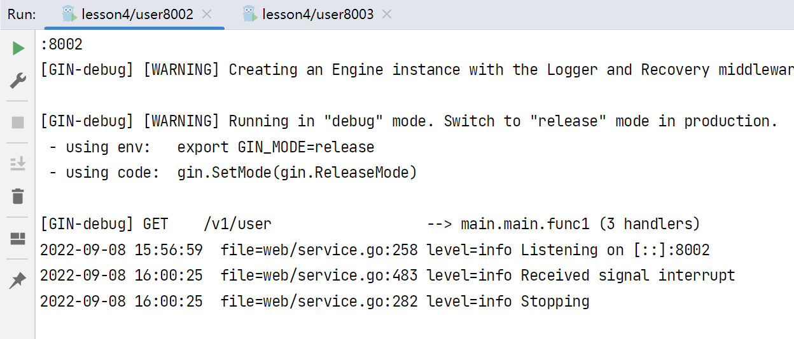
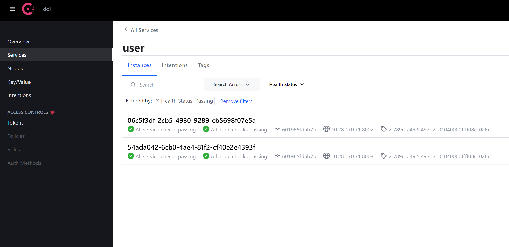

## 运行两个服务副本
使用flag包解析命令参数，来实现不同的端口对应不同服务
```go
address := flag.String("address", ":8002", "ip:port")
flag.Parse()    //这里一定别忘记！！！
```
```go
server := web.NewService(
		web.Name("user"),
		web.Address(*address),  //上面返回的是地址，需要间址
		web.Handler(r),
		web.Registry(csReg),
	)
```
### 运行方式一
terminal中直接运行
```shell
go run . --address=:8002
go run . --address=:8003
```
注意 `go run user.go --address=:8002`会报错，因为这样运行只编译了user.go。

### 运行方式二
在Goland中设置，然后运行



### 效果
