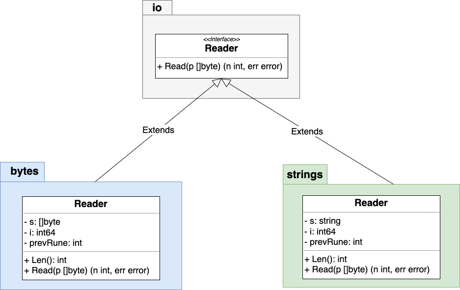

## HTTP api方式请求
暂时先使用HTTP方式请求user提供的接口，可以封装成一个函数，传入之前服务发现node的地址，拼接好请求路径，进行GET请求。
```go
for {
    next := selector.RoundRobin(myService)
    node, err := next()
    if err != nil {
        log.Fatal(err)
    }
    res, err := CallHttpAPI(node.Address, "/v1/user", "GET", nil)
    if err != nil {
        log.Fatal(err)
    }
    fmt.Printf("%v %v %v %s\n", node.Address, node.Id, node.Metadata, res)
    time.Sleep(time.Second)
}

func CallHttpAPI(address string, path string, method string, body []byte) (string, error) {
	req, err := http.NewRequest(method, "http://"+address+path, bytes.NewReader(body))
	if err != nil {
		return "", err
	}
	client := http.DefaultClient
	resp, err := client.Do(req)
	if err != nil {
		return "", err
	}
	defer resp.Body.Close()
	res, err := io.ReadAll(resp.Body)
	if err != nil {
		return "", err
	}
	return string(res), err
}
```
### 效果


另外：
- `[]byte`转`io.Reader`使用`bytes.NewReader()`
- `io.Reader`转`[]byte`使用`bytes.Buffer{}`
```go
buf := &bytes.Buffer{}
buf.ReadFrom(ioReaderData)
```
