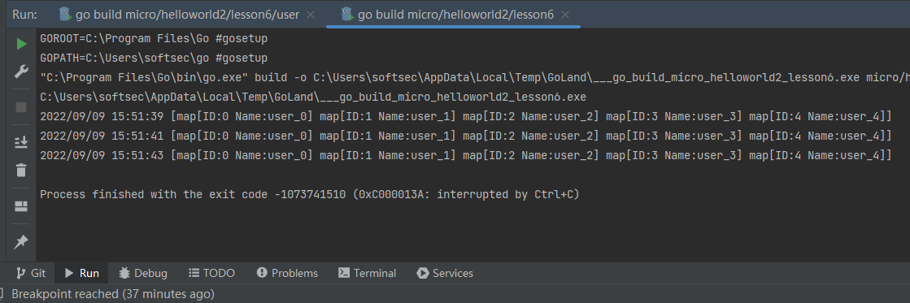

## 正规方式调用HTTP api
上节课使用手动方式调用，这次使用正规方式插件调用。

```go
func CallAPI(s selector.Selector) (map[string]interface{}, error) {

	myClient := http.NewClient(client.Selector(s), client.ContentType("application/json"))
	req := myClient.NewRequest("user", "/v1/user", map[string]string{})
	rsp := map[string]interface{}{}
	err := myClient.Call(context.Background(), req, &rsp)
	if err != nil {
		return nil, err
	}
	return rsp, err
}
```
需要添加一个新的方法CallAPI()

首先NewClient生成一个HttpClient("github.com/go-micro/plugins/v3/client/http")，需要传入Selector。

而selector是传入Register生成的。
```go
mySelector := selector.NewSelector(
			selector.Registry(reg),
			selector.SetStrategy(selector.RoundRobin),
		)
```

http.NewClient其中ContentType需要有 "application/json"

之后NewRequest，传入service name， endpoint， 传入参数

最后调用call方法，取回返回结果。

### 运行结果

